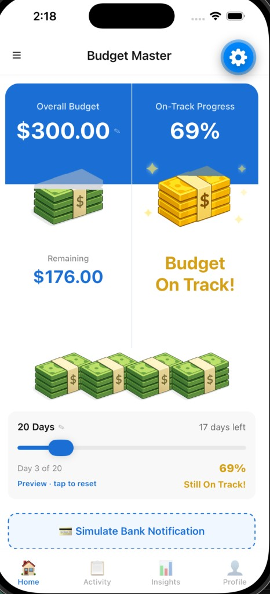

# Budget Master

A React Native (Expo) budgeting app with a visual cash-stack dashboard, on-track progress tracking, and animated bank-notification simulation. Budget Master turns abstract numbers into something you can see at a glance: how much you have left, whether you're pacing well through the period, and what just hit your account.

<p align="center">
  
</p>

## Highlights

| Feature | Description |
| --- | --- |
| **Dual dashboard cards** | Overall budget + remaining on the left; on-track progress % on the right with green/gold/red status |
| **Animated cash stacks** | 3D bill artwork that shakes and "flies off" when spending is detected |
| **Timeframe progress bar** | Interactive slider to preview how on-track you'd be on any day of the period |
| **Persistent setup** | Budget amount and timeframe saved locally via AsyncStorage |
| **Four-tab navigation** | Home, Activity, Insights, and Profile |
| **Demo mode** | Simulate incoming bank charges without a real bank connection |

## Screens

### Home

The main dashboard combines budget health, visual feedback, and recent transactions.

- **Overall Budget** — Your set budget with inline edit (pencil icon opens a modal)
- **On-Track Progress** — Percentage comparing remaining cash to expected remaining for the current day; turns gold with sparkles when you're pacing well
- **Mini cash stacks** — Decorative row of bill stacks above the progress card
- **Timeframe slider** — Drag to preview "what if I were on day X?" and see how your on-track % would change; tap **Preview · tap to reset** to return to today
- **Simulate Bank Notification** — Triggers a mock charge from Coffee Corner ($1–$40) with deduction animation
- **Recent Activity** — Last five transactions with fade-in animation; **View All** jumps to the Activity tab

### Activity

Full transaction history grouped by date. Each row shows merchant, category icon, amount, and time. Empty state prompts you to use the simulate button on Home.

### Insights

Spending analytics for the current period:

- Overview cards: budget, spent, remaining, and projected monthly spend
- Category breakdown with progress bars (Coffee & Drinks, Food & Dining, Shopping, Transport, Other)
- Budget health summary based on utilization

### Profile

User profile placeholder plus budget settings:

- Current budget amount and timeframe
- Connected bank status (demo)
- Notification toggles (push alerts, bank sync, weekly report)

On first launch, a **Budget Setup** modal walks you through choosing a timeframe (days/weeks/months/years) and entering your budget.

## Tech Stack

- **Expo SDK 56** — development and native builds
- **React Native 0.85** + **React 19**
- **React Navigation 7** — bottom tab navigator
- **AsyncStorage** — persists budget, timeframe, and period start date
- **@react-native-community/slider** — timeframe preview slider
- **Animated API** — cash-stack fly-off, sparkle, and transaction fade-in effects

## Getting Started

### Prerequisites

- Node.js 18+
- [Expo Go](https://expo.dev/go) on a physical device, **or** Xcode (iOS Simulator) / Android Studio (Android Emulator)

### Install and run

```bash
# Clone the repo, then:
npm install

# Start the dev server
npx expo start
```

From the Expo dev tools:

| Action | Command |
| --- | --- |
| iOS Simulator | Press `i` |
| Android Emulator | Press `a` |
| Physical device | Scan the QR code with Expo Go |

You can also use the npm scripts:

```bash
npm run ios      # expo run:ios
npm run android  # expo run:android
npm run web      # expo start --web
```

On first run you'll be prompted to set a budget and timeframe. After that, tap **Simulate Bank Notification** on Home to see the animation flow.

## How On-Track Progress Works

On-track progress answers: *"Given how much time is left in my budget period, am I spending at a sustainable pace?"*

```
expectedRemaining = budget × (daysRemaining / totalDays)
onTrackProgress   = (remaining / expectedRemaining) × 100
```

| Progress | Status label | Visual |
| --- | --- | --- |
| ≥ 75% | Budget Master! | Green stack, strong sparkles |
| 50–74% | Still On Track! | Gold stack |
| < 50% | Budget Better! | Green stack, red status text |

The timeframe slider on Home lets you scrub through days in the period to preview how your on-track score would look without changing real data.

## Animation Flow

When you tap **Simulate Bank Notification**:

1. A random Coffee Corner charge is created ($1–$40)
2. The matching mini cash stack shakes and a bill flies off
3. A pulsing "Deducting $X.XX..." label appears
4. After ~2 seconds the transaction is committed to state
5. Budget cards, on-track %, and Recent Activity update

The deduction picks the closest denomination stack ($1, $5, $20, or $100) based on the charge amount.

## Project Structure

```
BudgetMaster/
├── App.js                              # Root: SafeAreaProvider, BudgetProvider, tab navigation
├── assets/
│   ├── MainMoneyStack.png              # Green bill stack artwork
│   ├── GoldenMoneyStack.png            # Gold bill stack (on-track state)
│   └── screenshots/
│       └── home-screen.png             # README screenshot
├── src/
│   ├── context/
│   │   └── BudgetContext.js            # Global state, persistence, on-track math
│   ├── components/
│   │   ├── BudgetDualCard.js           # Overall budget + on-track dual cards
│   │   ├── BudgetEditModals.js         # Edit budget / timeframe modals
│   │   ├── BudgetSetupModal.js         # First-launch setup wizard
│   │   ├── CashStack.js              # Animated bill stacks
│   │   ├── EditPencil.js               # Inline edit affordance
│   │   └── TimeframeProgressBar.js     # Period slider + day counter
│   └── screens/
│       ├── HomeScreen.js               # Dashboard
│       ├── ActivityScreen.js           # Transaction history
│       ├── InsightsScreen.js           # Category analytics
│       └── ProfileScreen.js            # Settings & profile
└── package.json
```

## Customization

### Change budget or timeframe after setup

On Home, tap the pencil icon on **Overall Budget** or the timeframe label on the progress card. Changes persist to AsyncStorage and reset the period start date when the timeframe changes.

### Add transaction categories

Update `CATEGORY_CONFIG` in `src/screens/InsightsScreen.js` and `CATEGORY_ICONS` in `src/screens/ActivityScreen.js`. Pass the new `category` value when calling `addTransaction`.

### Adjust on-track thresholds

Edit `GOLD_THRESHOLD` (75) and `FAIR_THRESHOLD` (50) in `BudgetDualCard.js` and `TimeframeProgressBar.js`.

## Extending the App

### Real bank integration

Replace `simulateBankNotification()` in `BudgetContext.js` with a webhook or push handler (Plaid, MX, or your bank's API). Call `addTransaction()` with merchant, amount, category, and date when a charge arrives.

### Persist transactions

Budget and timeframe are already stored. To keep transactions across sessions, extend the AsyncStorage logic in `BudgetContext.js`:

```js
// Save after each transaction
await AsyncStorage.setItem('@mybudget/transactions', JSON.stringify(transactions));

// Load on mount alongside budget keys
const saved = await AsyncStorage.getItem('@mybudget/transactions');
if (saved) setTransactions(JSON.parse(saved).map(tx => ({ ...tx, date: new Date(tx.date) })));
```

### Add authentication

Profile screen is a static placeholder (`John Doe`). Wire it to your auth provider and pass user-specific budget data into `BudgetProvider`.

## License

Private project — all rights reserved.
